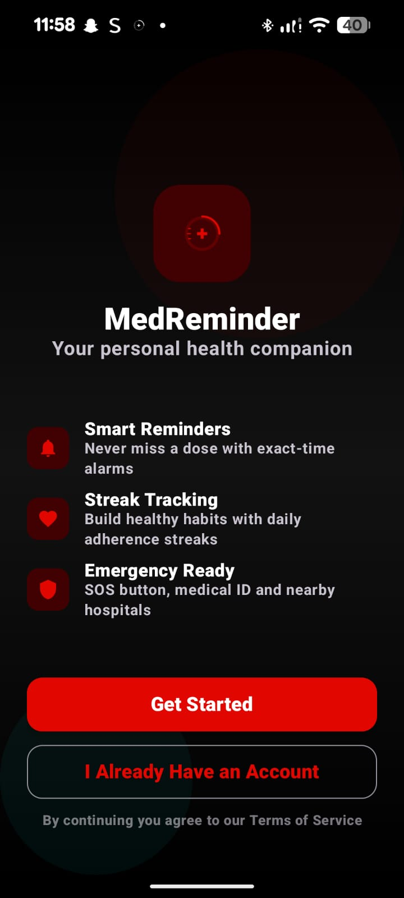
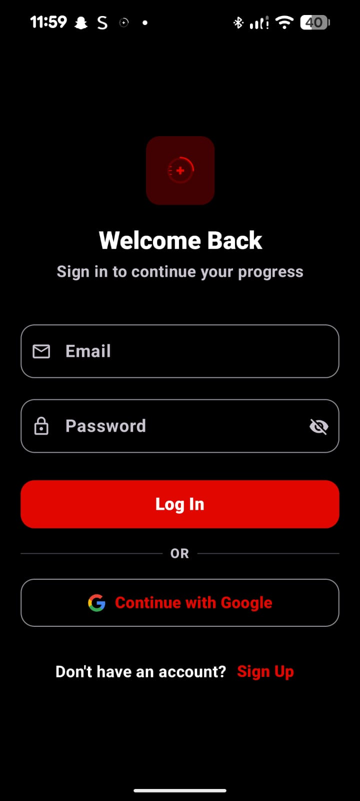
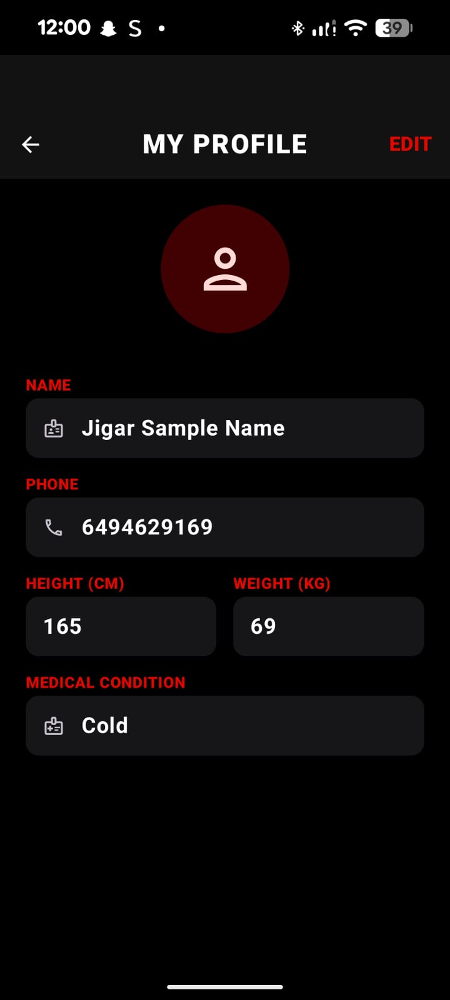
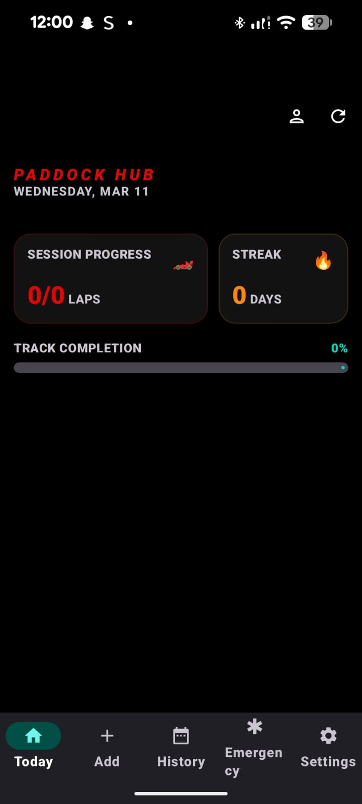
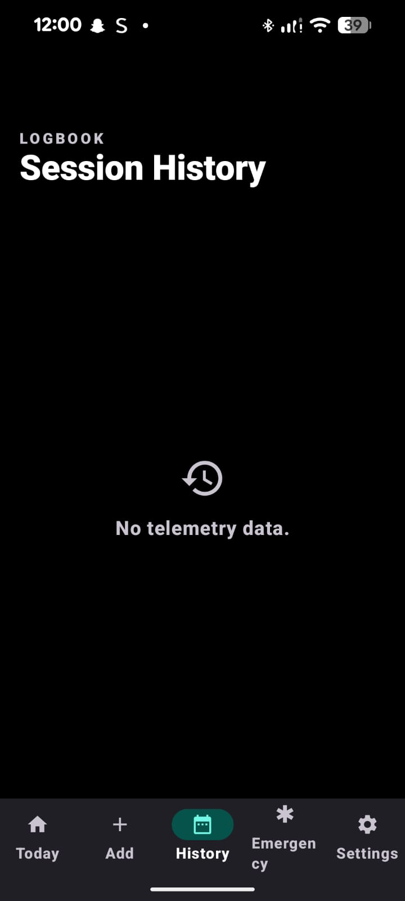
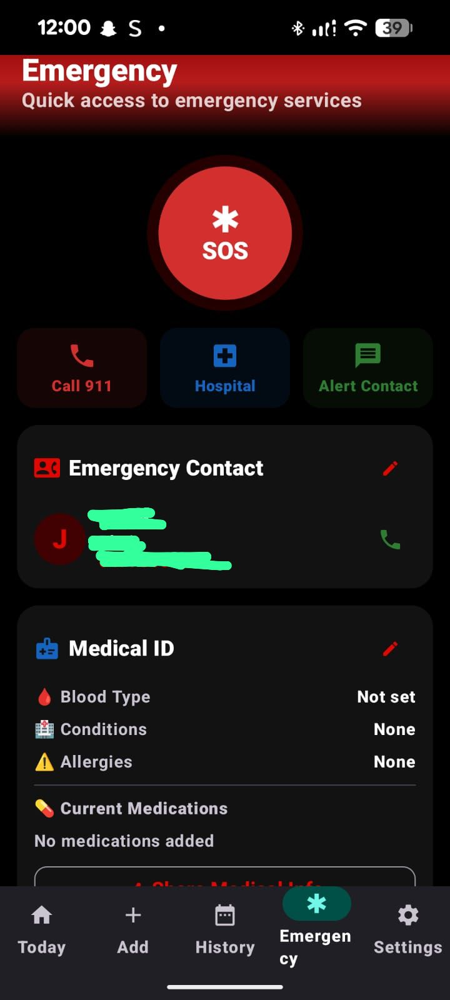
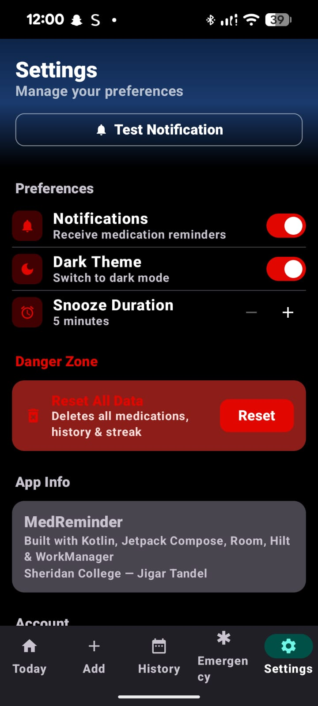
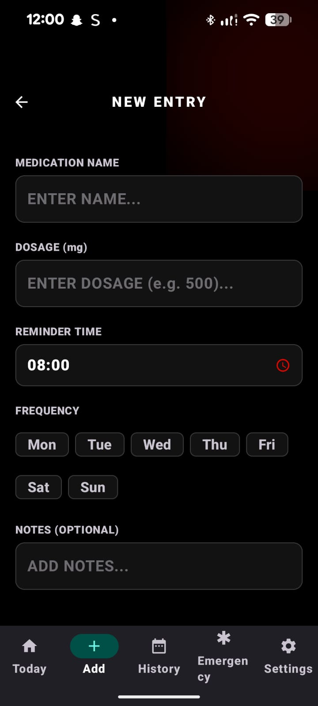
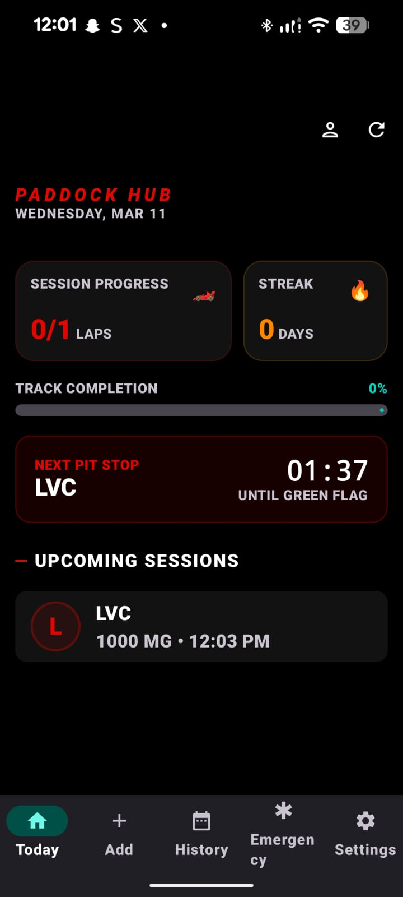

# MedReminder Paddock 💊🏎️

An Android medication management platform built with **Kotlin** and **Jetpack Compose**, featuring a high-octane **Racing-inspired UI** and robust security.

> Built as a personal project to demonstrate advanced Android architecture, cloud synchronization, and hardware integration.

---

## 📸 App Showcase

| Welcome | Auth | Profile | Dashboard | History |
| :---: | :---: | :---: | :---: | :---: |
|  |  |  |  |  |

| Emergency | Settings | Add Med | Reminder |
| :---: | :---: | :---: | :---: |
|  |  |  |  |

---

## 🚀 Key Innovation: "Racing Towards Health"

MedReminder transforms boring medication logs into a high-performance **Telemetry Dashboard**. Using a hybrid design of **Material 3 Expressive** components and a **F1 Paddock aesthetic**, users track their "Pit Stops" (doses) and "Laps" (completion) with professional precision.

### Unique Hardware Features:
- 📲 **NFC "Tap-to-Log"** — Stick an NFC tag on your pill bottle. Tapping your phone logs your dose instantly without even opening the app.
- 📉 **Automatic Refill Tracking** — The app calculates your remaining stock and provides "Low Fuel" warnings when you need a refill.
- 💊 **Visual Pill Builder** — Choose your pill's color and shape (Round, Capsule, Oval) to visually verify you're taking the right dose.

---

## 🔐 Security & Cloud

- **Multi-Account Authentication** — Secure login via **Google Sign-In** or Email/Password, with automatic existing-user detection and helpful sign-in prompts.
- **Cloud Synchronization** — Every dose, medication, and profile detail is backed up in real-time to **Firebase Firestore**.
- **User Telemetry** — Tracks personal health metrics including Height, Weight, and medical conditions for a personalized experience.

---

## Features

- 📅 **Session Dashboard** — Real-time **Countdown Timer** to your next dose based on system clock.
- 👆 **Paddock Interaction** — Swipe-to-confirm dosage prevents accidental logging.
- ⚠️ **Double-Dose Prevention** — Intelligent safety checks prevent taking the same medication within a 2-hour window.
- 📊 **Streak Telemetry** — High-contrast flame tracking for your daily adherence streaks.
- 🕓 **Logbook** — A detailed racing history of every dose taken, timestamped and categorized.
- 🌙 **Midnight Glass UI** — Premium glassmorphic elements combined with a deep black racing theme.

---

## Tech Stack

| Layer | Technology |
|-------|-----------|
| **Language** | Kotlin (1.9+) |
| **UI** | Jetpack Compose + Material 3 Expressive |
| **Architecture** | Clean Architecture (MVVM + Repository + UseCases) |
| **Backend** | Firebase Auth + Firebase Firestore |
| **DI** | Hilt (Dagger) |
| **Database** | Room (Local Caching) |
| **Background** | WorkManager (Reliable Notifications) |
| **NFC** | Android NFC Foreground Dispatch |
| **Images** | Coil (Async Profile Loading) |

---

## Architecture

```
app/
├── data/
│   ├── local/          # Room Database & Local Caching
│   ├── datastore/      # User Preferences (Theme, Notifications)
│   └── repository/     # Auth, Firestore Sync, and Medication Logic
├── domain/
│   ├── model/          # User, Medication, IntakeLog models
│   └── usecase/        # Independent Business Logic
├── presentation/
│   ├── auth/           # Login, Sign Up, Profile Onboarding
│   ├── today/          # Racing Dashboard & Live Timer
│   ├── history/        # Logbook Telemetry
│   └── settings/       # Account & App Configuration
├── worker/             # Background Reminders & Daily Resets
└── navigation/         # Type-safe Jetpack Navigation
```

---

## How to Run

1.  **Firebase Setup**:
    -   Create a Firebase project.
    -   Enable Google Auth and Firestore.
    -   Add your SHA-1 to the Firebase project settings.
    -   Download `google-services.json` and place it in the `app/` directory.
2.  **Clone & Build**:
    ```bash
    git clone https://github.com/tandelj-coder/MedReminder.git
    cd MedReminder
    ./gradlew assembleDebug
    ```

---

## Author

**Jigar Tandel** — 3rd Year B.Sc. Computer Science, Sheridan College  
[GitHub](https://github.com/tandelj-coder) · [LinkedIn](https://linkedin.com/in/student-sheridan)
